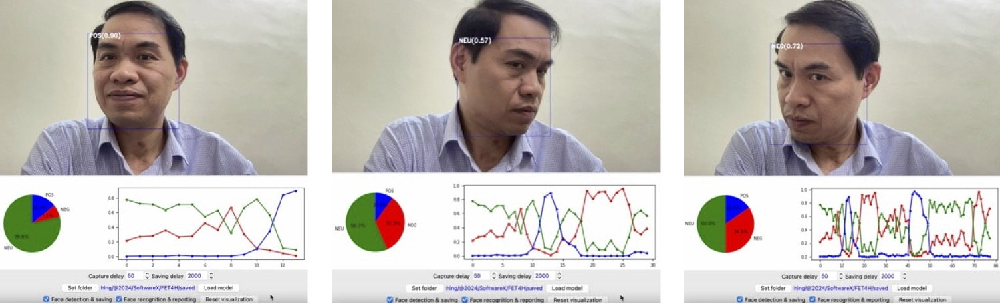

# FET4H: Efficient Hierarchical CNN Model with Self-Attention for Three-Category Facial Emotion Tracking in Healthcare Applications
## Overview
The FET4H system monitors and evaluates patients' emotions for healthcare applications. It can integrate with other systems via APIs or run as a standalone module on client devices. The system captures images or videos, processes them, and recognizes facial emotions, generating timestamped results for storage, evaluation, and visualization over specific periods or interactions.
## Features
The FET4H software offers key functionalities, including face detection, facial emotion recognition, result tracking, and real-time visualization. It captures frames in real-time (e.g., from a webcam or RTSP stream) and uses libraries like MediaPipe to detect faces and extract bounding boxes. The integrated FET4H model classifies emotions (NEGative, NEUtral, POSitive) with confidence scores, displaying results on-screen in real-time and storing them for analysis.
Real-time visualizations include a pie chart showing the emotion distribution and a line chart plotting confidence levels over time, both with dynamic updates and distinct colors. Captured images and detailed logs of detected faces and emotions are saved to a configurable folder for retraining or integration with other systems.
## Installation & usage
To use FET4H (e.g., on macOS), follow these steps:
1. Clone the repository:
<pre> git  clone  https://github.com/duongthanglong/FET4H.git </pre>
2. Navigate to the folder containing the saved model `./FET4H_model/variables`. Combine all chunks of the FET4H_model shards into a single file using the following command:
<pre> cat  variables.data-00000-of-00001_*  >  variables.data-00000-of-00001 </pre>
3. Install the required dependencies: `pip  install  -r  requirements.txt`
4. Two usage scenarios for the FET4H system (standalone or as a library of the FET4H model in your Python project):
    * Run as standalone: `python   FET4H.py`
    * Import the FET4H_model into your Python project, and create an instance of the FET4H model for facial emotion prediction:
      <pre>   import  tensorflow  as  tf
         from  FET4H_model  import  *
         model = tf.keras.models.load_model('../FET4H_model')
         y_preds = model.predict(#list_of_images#) </pre>    
      Here, the images in `#list_of_images#` should be normalized to the range `[-1, 1]` and have the shape `[70, 70, 3]`. The predicted `y_preds` is an array of probabilities corresponding to emotions for each image. To obtain the predicted emotion for each image, apply `tf.argmax` on the probabilities. The emotion labels, by index, are as follows: `{0: 'negative', 1: 'neutral', 2: 'positive'}`
## Examples
This is an example of screenshots from the software running:
 
## Dataset for training and testing
1. CK+ is available in the paper: P. Lucey, J. F. Cohn, T. Kanade, J. Saragih and Z. Ambadar, "The Extended Cohn-Kanade Dataset (CK+): A complete dataset for action unit and emotion-specified expression," IEEE Computer Society Conference on Computer Vision and Pattern Recognition - Workshops, pp. 94-101, 2010. https://doi.org/10.1109/CVPRW.2010.5543262.
2. OuluCASIA is available in the paper: G. Zhao, X. Huang, M. Taini, S. Z. Li and M. Pietikäinen, "Facial expression recognition from near-infrared videos," Image and Vision Computing, vol. 29, p. 607–619, 2011.
3. RAF-DB is available in the paper: S. a. D. W. Li, "Reliable Crowdsourcing and Deep Locality-Preserving Learning for Unconstrained Facial Expression Recognition," IEEE Transactions on Image Processing, vol. 28, no. 1, pp. 356-370, 2019.
4. FERplus (FER+) is available in the paper: C. Z. C. C. F. a. Z. Z. Emad Barsoum, "Training Deep Networks for Facial Expression Recognition with Crowd-Sourced Label Distribution," ACM International Conference on Multimodal Interaction, p. https://doi.org/10.48550/arXiv.1608.01041, 2016.
5. AffectNet is available in the paper: A. MOLLAHOSSEINI, B. HASANI and M. H. MAHOOR, "AffectNet: A Database for Facial Expression, Valence, and Arousal Computing in the Wild," IEEE Transactions on Affective Computing, vol. 10, pp. 18-31; https://arxiv.org/abs/1708.03985, 2017.
